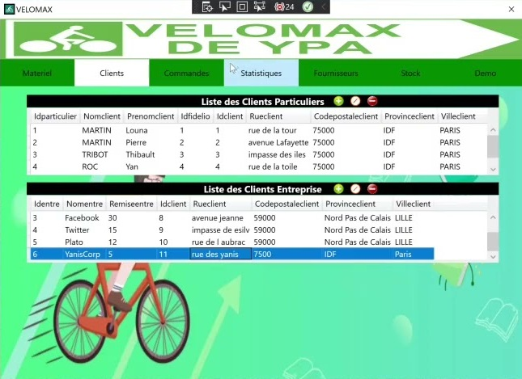

<h1 align="center">
  
</h1>

---

# LOGICIEL DE GESTION D’UN MAGASIN DE VELO

## Petit résumé

- VéloMax est une compagnie qui vend des bicyclettes et des pièces de rechange celle-ci. Étant donné la croissance continue du volume des ventes ces dernières années, La direction de l'entreprise désire disposer d'un nouvel outil afin de mieux gérer son stock et ses clients.

## Objectif

- Gestion des pièces de rechange.
- Gestion des vélos en magasin.
- Gestion des clients (particuliers ou entreprises).
- Gestion des fournisseurs.
- Gestion des commandes.

## Techno
- SQL
- C#
- WPF
- Visual Studio 2019
- MySQL

## UML

## Demo

## Auteur
- [@Pierre](https://github.com/Pierre-Portfolio)
- [@Yanis](https://github.com/YanisOUARAS)
